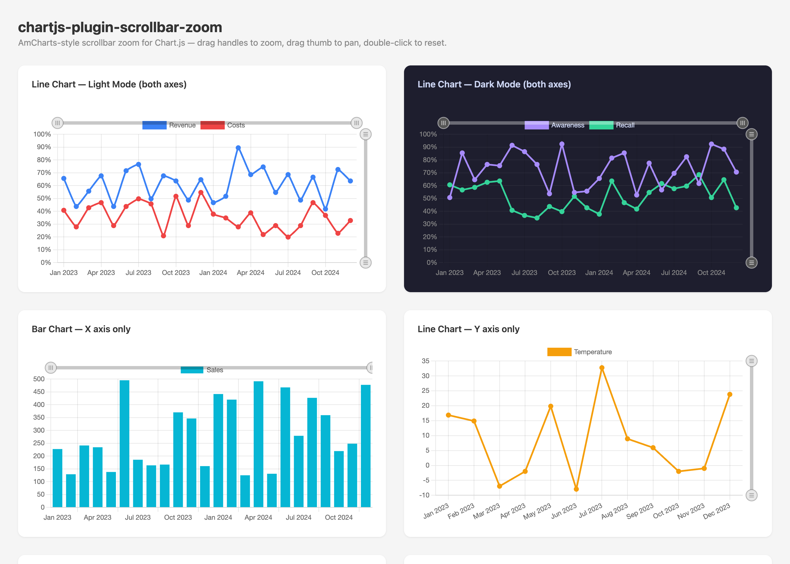

# chartjs-plugin-scrollbar-zoom

Scrollbar zoom controls for [Chart.js](https://www.chartjs.org/) — draggable handles, pan, and visual scrollbar tracks for both axes.

Unlike `chartjs-plugin-zoom` (which uses pinch/wheel gestures), this plugin renders **visual scrollbar controls** directly on the canvas with draggable handles on each end, matching the UX of AmCharts, Highcharts, and other premium charting libraries.



## Features

- **Always-visible scrollbars** with track, thumb, and round grip handles
- **Drag handles** to zoom from either end of the range
- **Drag thumb** to pan the visible viewport
- **Double-click** to reset zoom to full view
- **Both axes** — independent X and Y scrollbars (or single axis)
- **Preserve tick values** — prevents Chart.js from generating decimal ticks when zoomed
- **Dark mode** support with separate color sets
- **Fully customizable** — colors, sizes, positions, and callbacks
- **Zero dependencies** — pure Canvas2D rendering, no DOM elements
- Works with Chart.js 3.x and 4.x, line and bar charts

## Installation

```bash
npm install chartjs-plugin-scrollbar-zoom
```

## Quick Start

```js
import { Chart } from 'chart.js';
import ScrollbarZoomPlugin from 'chartjs-plugin-scrollbar-zoom';

// Register globally
Chart.register(ScrollbarZoomPlugin);

// Or per-chart via the plugins array
new Chart(ctx, {
  type: 'line',
  data: { /* ... */ },
  options: {
    // Add padding to make room for scrollbars
    layout: { padding: { top: 32, right: 28 } },
    plugins: {
      scrollbarZoom: {
        enabled: true,
      },
    },
  },
});
```

## Options

All options are set under `options.plugins.scrollbarZoom`:

| Option | Type | Default | Description |
|---|---|---|---|
| `enabled` | `boolean` | `true` | Enable or disable the plugin |
| `axes` | `'x' \| 'y' \| 'both'` | `'both'` | Which axes get scrollbars |
| `xPosition` | `'top' \| 'bottom'` | `'top'` | X scrollbar position |
| `yPosition` | `'left' \| 'right'` | `'right'` | Y scrollbar position |
| `trackSize` | `number` | `6` | Track height/width in px |
| `handleRadius` | `number` | `10` | Handle circle radius in px |
| `xOffset` | `number` | `20` | Distance from chart area to X scrollbar center |
| `yOffset` | `number` | `16` | Distance from chart area to Y scrollbar center |
| `minThumbFraction` | `number` | `0.08` | Minimum thumb size (0–1 fraction of track) |
| `dark` | `boolean` | `false` | Use dark-mode colors |
| `colors` | `ScrollbarColors` | — | Custom light-mode colors (see below) |
| `darkColors` | `ScrollbarColors` | — | Custom dark-mode colors (see below) |
| `preserveYTicks` | `boolean` | `true` | Keep only original Y tick values when zoomed |
| `onZoomChange` | `function` | — | Callback on viewport change |

### ScrollbarColors

```ts
interface ScrollbarColors {
  track?: string;        // Track background
  thumb?: string;        // Thumb (selected range) fill
  handleFill?: string;   // Handle circle fill
  handleStroke?: string; // Handle circle border
  grip?: string;         // Handle grip-line color
}
```

### Default Colors

**Light mode:**
| Part | Color |
|---|---|
| Track | `rgba(0,0,0,0.08)` |
| Thumb | `rgba(0,0,0,0.15)` |
| Handle fill | `#e8e8e8` |
| Handle stroke | `rgba(0,0,0,0.25)` |
| Grip lines | `rgba(0,0,0,0.35)` |

**Dark mode:**
| Part | Color |
|---|---|
| Track | `rgba(255,255,255,0.12)` |
| Thumb | `rgba(255,255,255,0.25)` |
| Handle fill | `#555` |
| Handle stroke | `rgba(255,255,255,0.5)` |
| Grip lines | `rgba(255,255,255,0.7)` |

## Layout Padding

The scrollbars are drawn outside the chart area, so you need to add `layout.padding` to reserve space. Typical values:

```js
// Both axes, X on top, Y on right
layout: { padding: { top: 32, right: 28 } }

// X only on top
layout: { padding: { top: 32 } }

// Y only on right
layout: { padding: { right: 28 } }

// X on bottom
layout: { padding: { bottom: 32 } }
```

## Examples

### Both Axes (default)

```js
new Chart(ctx, {
  type: 'line',
  data: { labels, datasets },
  options: {
    layout: { padding: { top: 32, right: 28 } },
    plugins: {
      scrollbarZoom: { enabled: true },
    },
  },
});
```

### Dark Mode

```js
plugins: {
  scrollbarZoom: {
    enabled: true,
    dark: true,
  },
}
```

### X Axis Only

```js
options: {
  layout: { padding: { top: 32 } },
  plugins: {
    scrollbarZoom: {
      enabled: true,
      axes: 'x',
    },
  },
}
```

### Custom Purple Theme

```js
plugins: {
  scrollbarZoom: {
    enabled: true,
    trackSize: 8,
    handleRadius: 12,
    colors: {
      track: 'rgba(139,92,246,0.1)',
      thumb: 'rgba(139,92,246,0.25)',
      handleFill: '#ede9fe',
      handleStroke: 'rgba(139,92,246,0.4)',
      grip: 'rgba(139,92,246,0.6)',
    },
  },
}
```

### Zoom Change Callback

```js
plugins: {
  scrollbarZoom: {
    enabled: true,
    onZoomChange: ({ xStart, xEnd, yStart, yEnd }) => {
      console.log(`X: ${xStart.toFixed(2)}–${xEnd.toFixed(2)}`);
      console.log(`Y: ${yStart.toFixed(2)}–${yEnd.toFixed(2)}`);
    },
  },
}
```

## Interaction

| Action | Effect |
|---|---|
| Drag a handle | Zoom in/out from that end |
| Drag the thumb | Pan the visible range |
| Double-click chart | Reset to full view |

## TypeScript

Full type definitions are included. Augment Chart.js plugin options:

```ts
import type { ScrollbarZoomOptions } from 'chartjs-plugin-scrollbar-zoom';

declare module 'chart.js' {
  interface PluginOptionsByType<TType> {
    scrollbarZoom?: ScrollbarZoomOptions;
  }
}
```

## Testing

The plugin includes a full test suite (25 tests) using [Vitest](https://vitest.dev/) with jsdom. Tests run automatically before every build.

```bash
npm test          # Run tests once
npm run test:watch  # Run tests in watch mode
npm run build     # Tests + build (CJS, ESM, IIFE)
```

## Demo

Open `demo/index.html` in a browser after building (`npm run build`) to see live examples with light/dark mode, custom colors, axis configurations, and positioning options.

A live demo is available at [odysseyab.github.io/chartjs-plugin-scrollbar-zoom](https://odysseyab.github.io/chartjs-plugin-scrollbar-zoom/demo/).

## License

MIT — [OdysseyAB](https://github.com/OdysseyAB)
